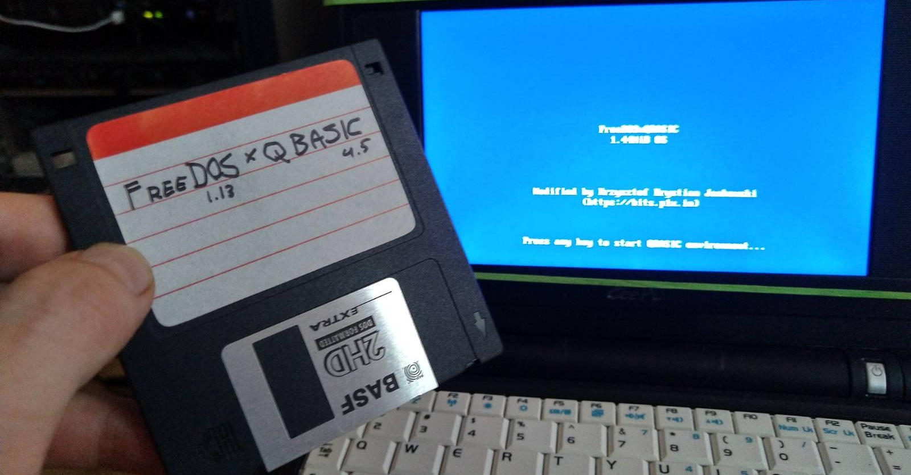

# FreeDOSxQBASIC

Single floppy embedded system with Microsoft (R) QuickBasic

Read [full article about this project at bits.p1x.in](https://bits.p1x.in/freedos-with-qbasic-on-single-floppy/).

## Run
qemu-system-i386 -fda FreeDOSxQBASIC-plus.img -m 2
